# Co-messager

> 地址：http://co-messager.chenr.cn/#/index

## 相关文章地址

- [掘金](https://juejin.im/post/5e8dd45cf265da47e34bf94d)

## 功能
- [x] 登陆注册
- [x] 单聊
- [x] 群聊
- [x] 历史消息
- [x] 图片发送
- [ ] 文件发送
- [ ] 代码片段发送
- [x] 表情发送
- [x] 白板协作
- [x] 音视频聊天
- [x] 消息已读提醒
- [x] 好友分组
- [x] 好友备注
- [x] 好友上线提醒
- [x] 在线用户头像高亮
- [x] 添加好友
- [x] 添加群聊
- [x] 朋友圈功能
- [x] 发表朋友圈
- [x] 好友朋友圈
- [x] 朋友圈动态点赞
- [x] 朋友圈动态评论
- [x] 朋友圈动态回复评论
- [x] 日程设置

## 概要

本系统分为`Client`，`Server`，`Admin`三个端：其中`Client`为客户端，`Server`为服务器端，`Admin`为管理员端。

## 项目截图

### 1、主页
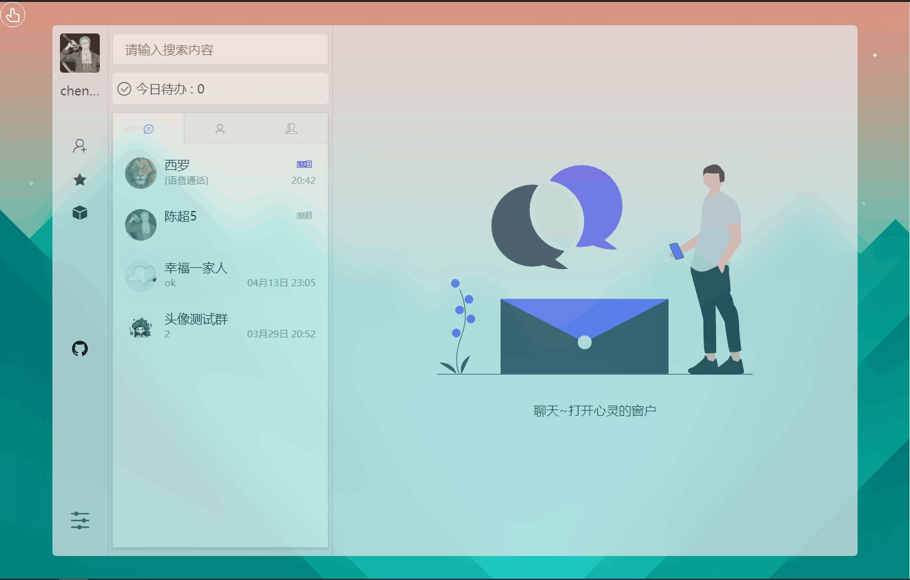

### 2、聊天
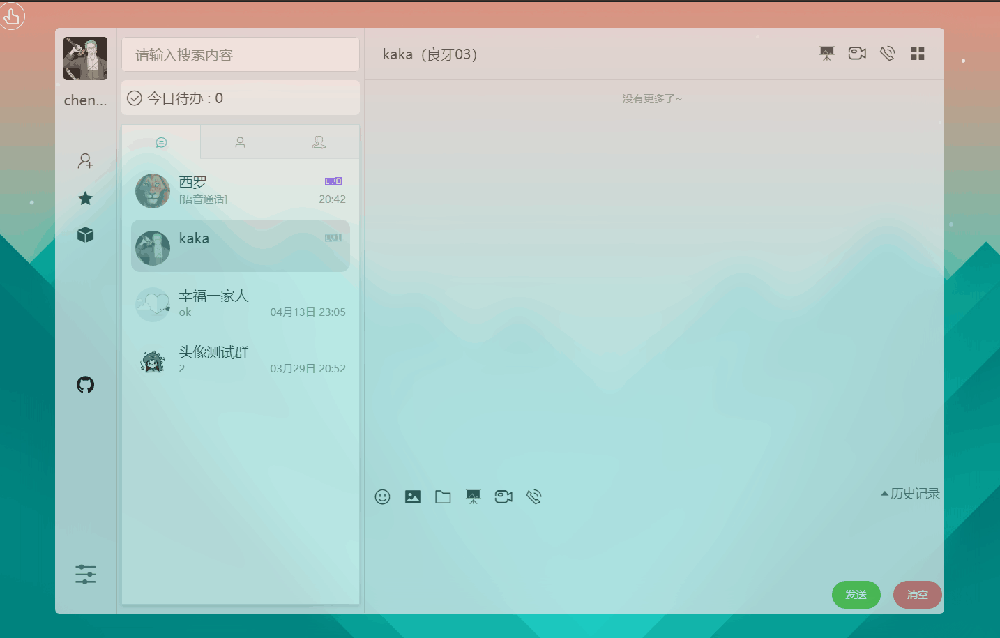
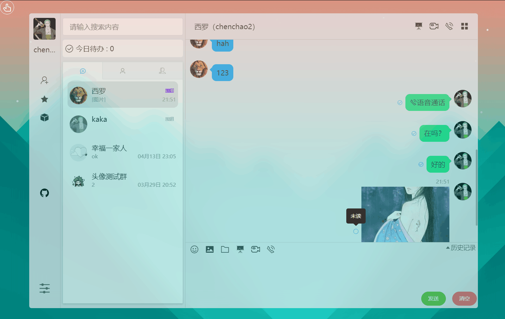
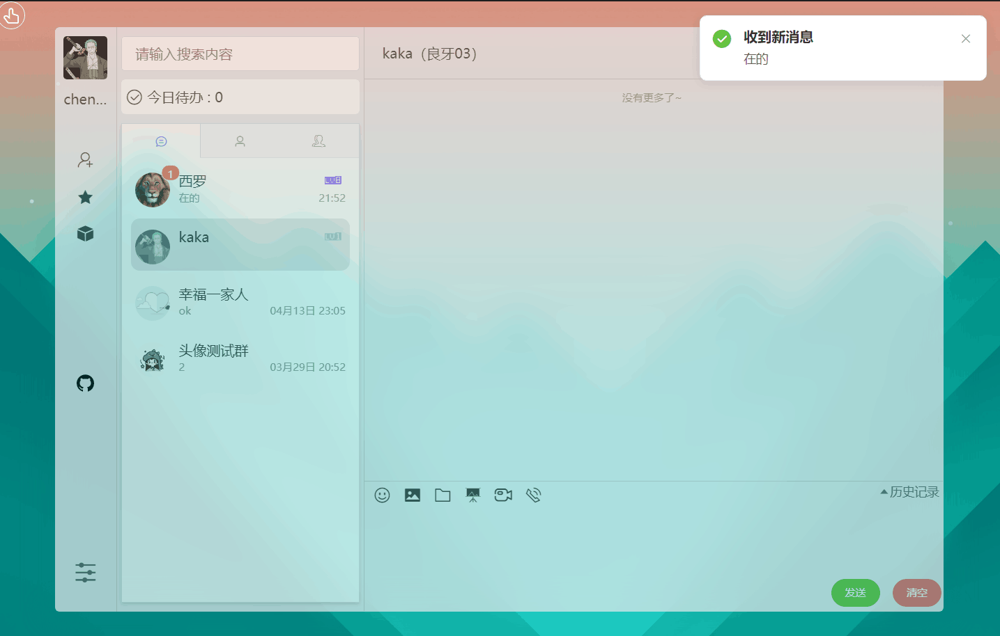

### 3、朋友圈

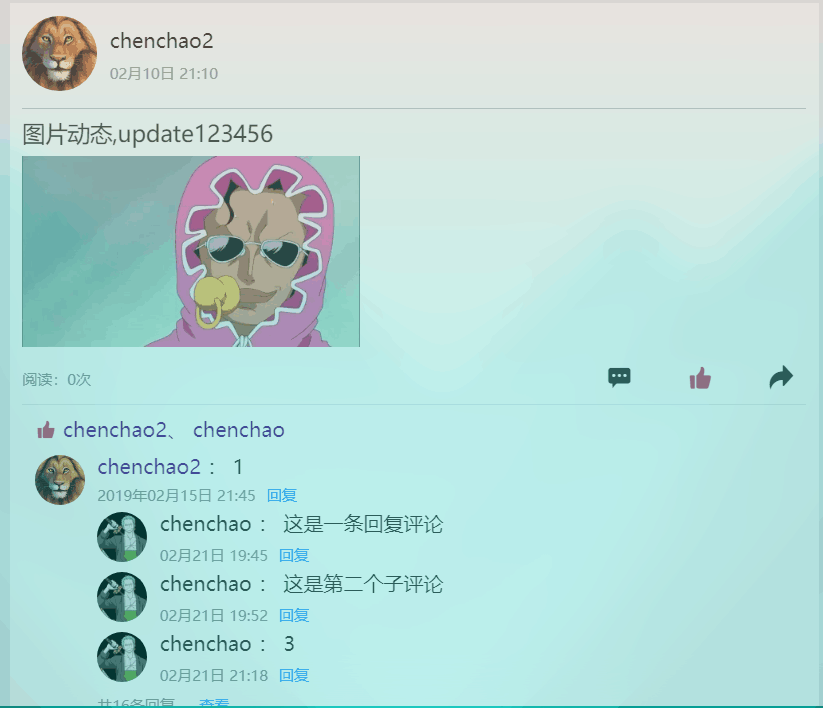

### 4、主题设置
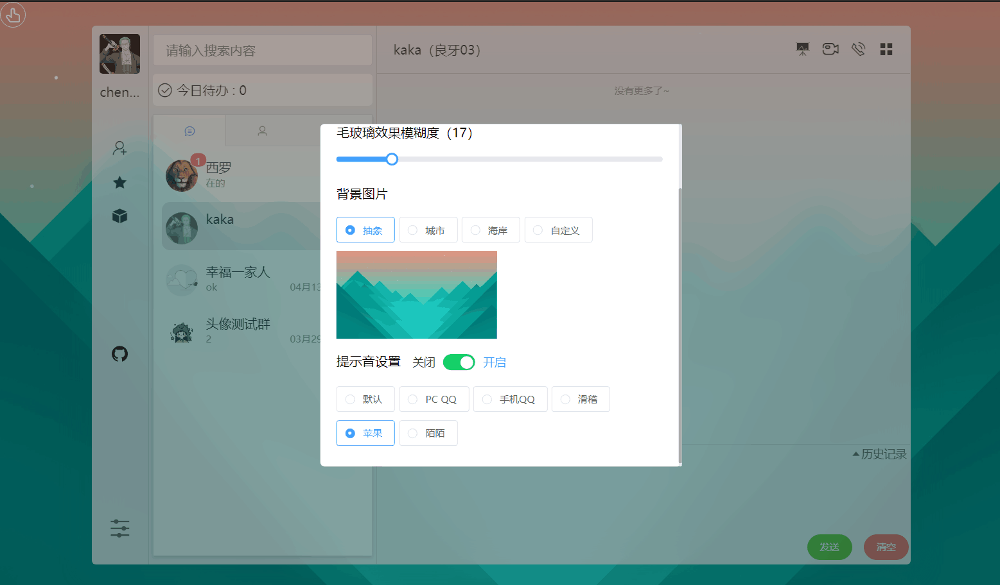

### 5、日程
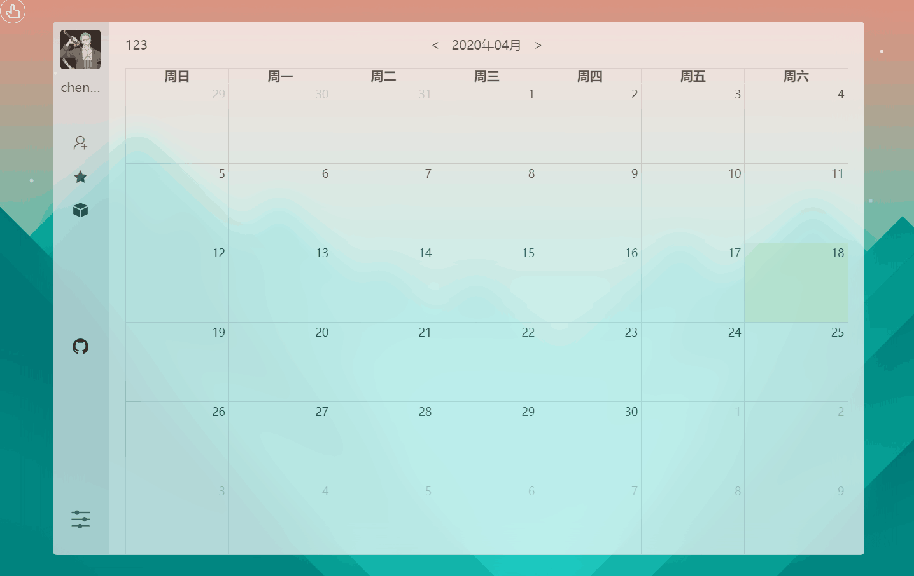


### 6、个人中心
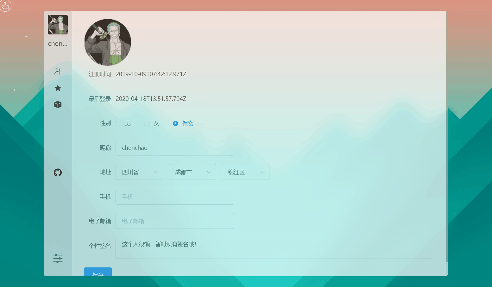


## 系统功能图

### 普通用户
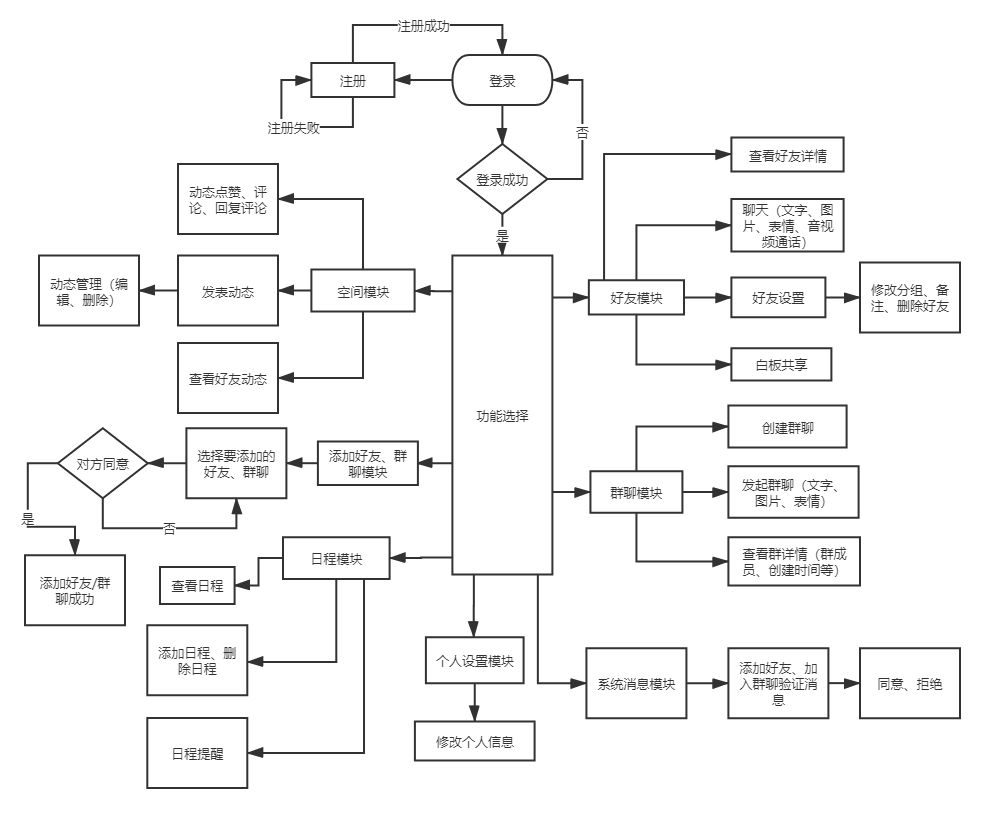

### 管理员
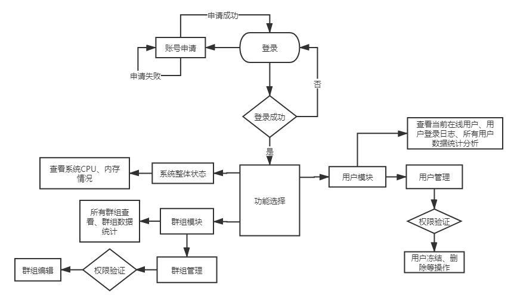

## 技术路线

> 本项目为前后端分离的开发模式

- 客户端使用`Vue`、`VueX`、`Vue-Router`等；
- 管理员端使用`React`、`antd`等技术栈；
- 后端使用的是`node.js`；
- 数据库使用的是`MongoDB`；
- 在实现聊天的全双工数据通信使用的是`WebSocket`。

## 启动项目

- 克隆项目

`git clone git@github.com:CCZX/wechat.git`

- 删除相关代码

> 这部分代码是在我的数据库里，所以你需要删除或者替换相关代码以防报错

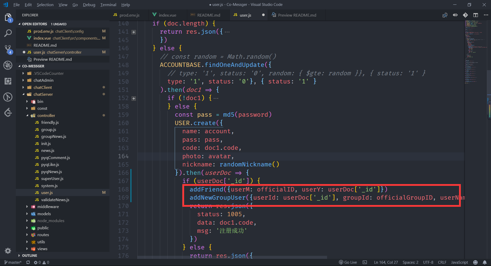

- 启动服务器（3333端口）

```javascript
cd chatServer
npm install
node init.js // 初始化数据库
node app.js
```

- 启动客户端（8080端口）
```javascript
cd chatClient
npm install
npm run dev
```

- 启动管理员端（3000端口）
```javascript
cd chatAdmin
npm install
npm start
```

启动完成后流群访问`localhost:8080`以及`localhost:3000`可以分别访问客户端以及管理员端。

## 项目打包

1. 客户端的代码打包后资源默认放在`chatServer`文件夹的`public`目录下；
2. 管理员端在`chatAdmin`的`build`目录下，需要自己自己手动将整个build目录复制到`chatServer`文件夹的`public`目录下，然后修改`build`目录文件的`index.html`中引入资源路径前都加上`/build`。

## 交流

- qq群


大家今天学习到了什么知识、有什么好的学习方法、学习技巧或者什么摸鱼的方法都可以一起交流哟。

目前本人在使用react+Typescript搭建一个UI框架，基本架子已经搭建好，到时候会上传至GitHub，到时候欢迎大家一起讨论。

## 联系

- `E-mail`：`ccdebuging@gmail.com`、`cAuth1218@163.com`
- `QQ`：`1831058205`

## 参考项目

- https://github.com/wuyawei


