# Co-messager

> 本项目不再维护，如在阅读**文档**、观看**视频**后任有问题可以加群或者本人 `QQ` 和微信。

## 相关工具版本

1. node: 12.14.0
2. npm: 6.4.1
3. MongoDB: 5.0.3

## 相关地址

- [掘金-文章](https://juejin.im/post/5e8dd45cf265da47e34bf94d)
- [功能介绍-视频](https://www.bilibili.com/video/BV1aX4y1K7EF?p=1)
- [项目运行-视频](https://www.bilibili.com/video/BV1aX4y1K7EF?p=2)

## 功能
- [x] 登陆注册
- [x] 单聊
- [x] 群聊
- [x] 历史消息
- [x] 图片发送
- [ ] 文件发送
- [ ] 代码片段发送
- [x] 表情发送
- [x] 白板协作
- [x] 音视频聊天
- [x] 消息已读提醒
- [x] 好友分组
- [x] 好友备注
- [x] 好友上线提醒
- [x] 在线用户头像高亮
- [x] 添加好友
- [x] 添加群聊
- [x] 朋友圈功能
- [x] 发表朋友圈
- [x] 好友朋友圈
- [x] 朋友圈动态点赞
- [x] 朋友圈动态评论
- [x] 朋友圈动态回复评论
- [x] 日程设置

## 启动项目

### 1、克隆项目

```bash
git clone git@github.com:CCZX/wechat.git
```

或者下载压缩包解压也可以。

### 2、删除相关代码

> 这部分代码是在我的数据库里，所以你需要删除或者替换相关代码以防报错


**需要注意的是这一步需要在启动服务端之前执行。不然会出现不可预料的错误**

### 2、启动MongoDB数据库

```bash
mongo
```

如果还没有安装MongoDB可以参考下面文章：
- [mongoDB - 菜鸟教程](https://www.runoob.com/mongodb/mongodb-tutorial.html)
- [mongoDB的安装和启动](https://juejin.cn/post/6844903958826188808)

### 3、启动服务器

```bash
cd chatServer
npm install
# 初始化数据库，初始化成功后可以看到自动创建了chat数据库
node init.js
node app.js
```

### 4、启动客户端
```bash
cd chatClient
npm install
npm run dev
```

启动成功后访问[127.0.0.1:8080](127.0.0.1:8080)即可访问。

### 5、启动管理员端（3000端口）
```bash
cd chatAdmin
npm install
npm start
```

启动成功后访问[127.0.0.1:3000](127.0.0.1:3000)即可访问。

### 6、Q&A

按照上述步骤启动一般是不会出问题，有问题请首先排查是否**执行顺序**不一致，以及数据库是否启动。


## 项目截图

**github上如果没有科学上网容易裂图，推荐在掘金上看：** 

地址：https://juejin.im/post/5e8dd45cf265da47e34bf94d

### PC端

#### 1、主页
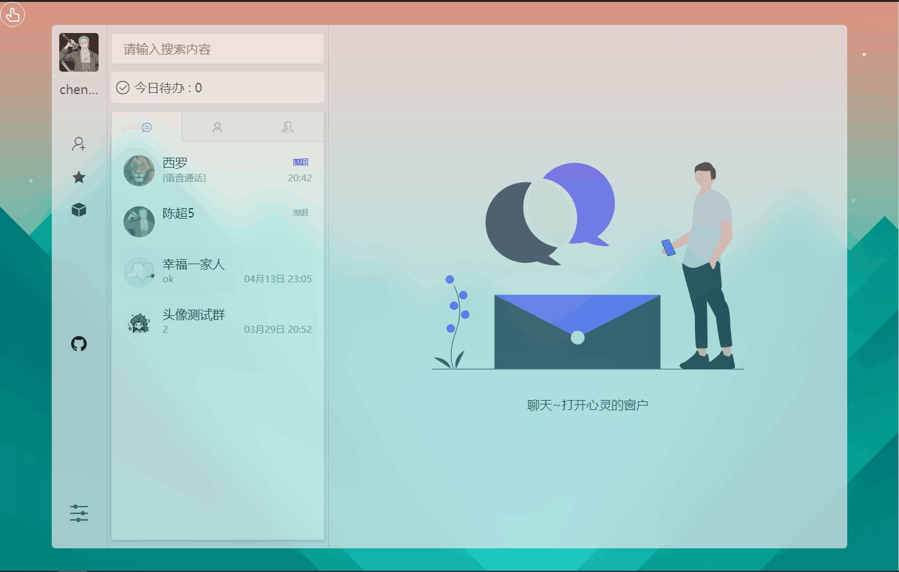

#### 2、聊天
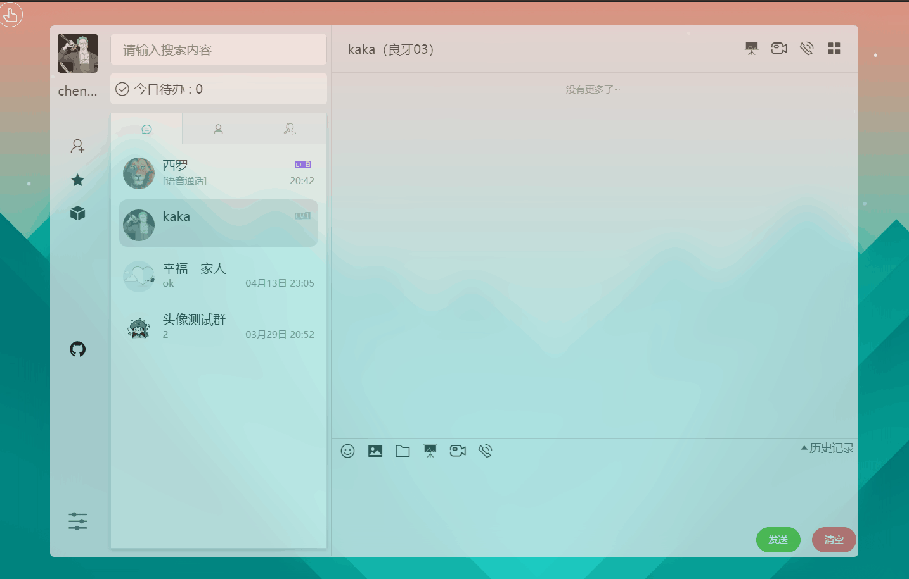
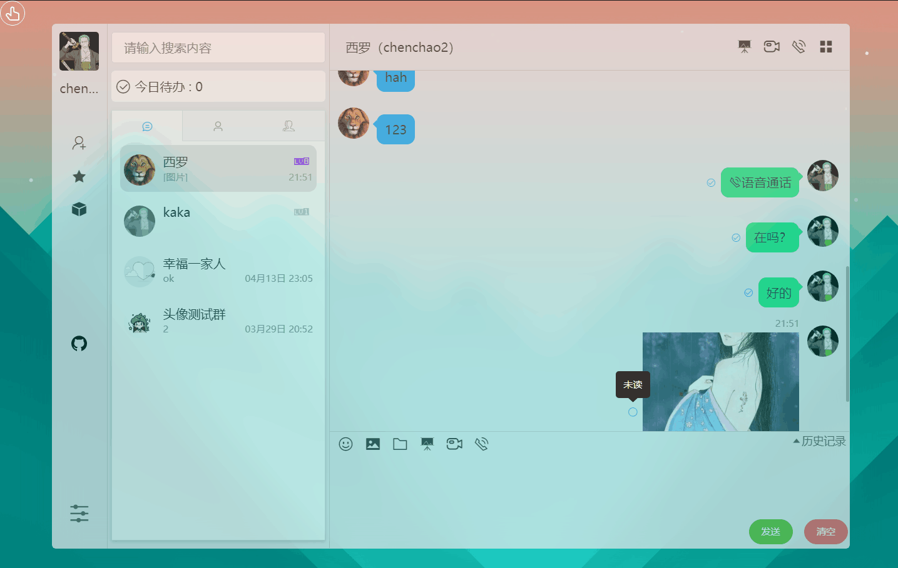


#### 3、朋友圈

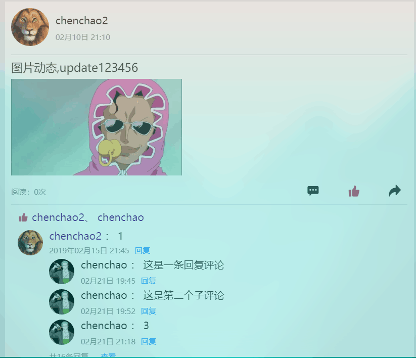

#### 4、主题设置
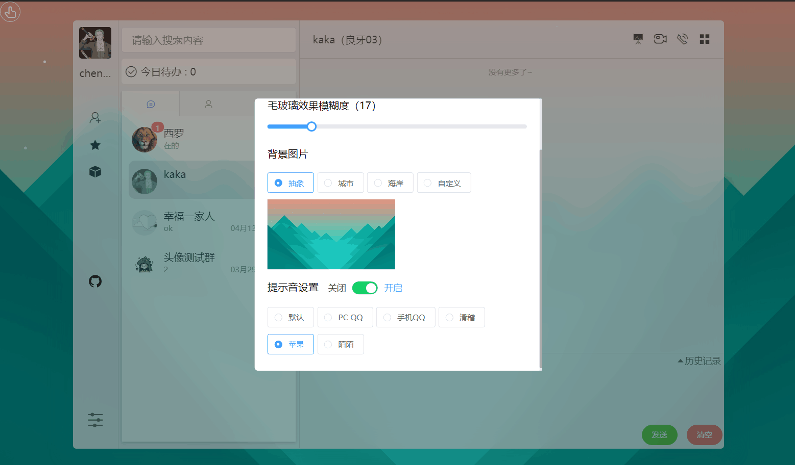

#### 5、日程

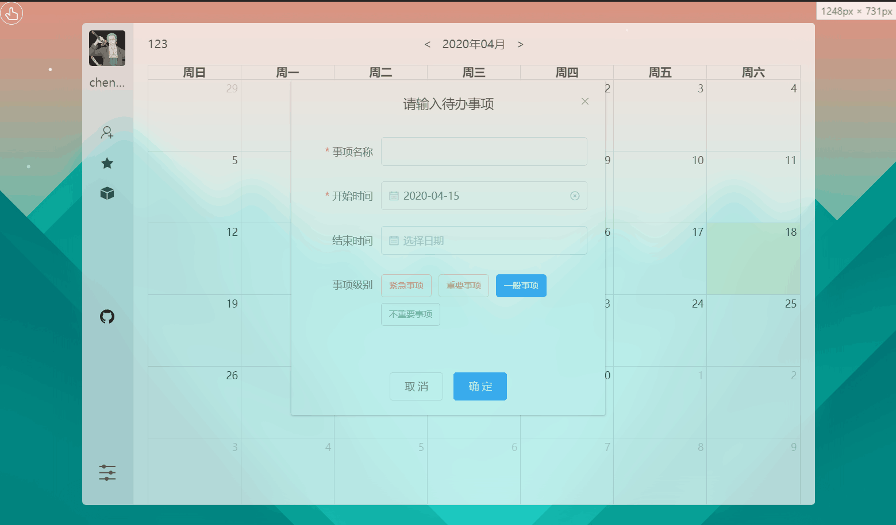

#### 6、个人中心


### 移动端

#### 1、登录
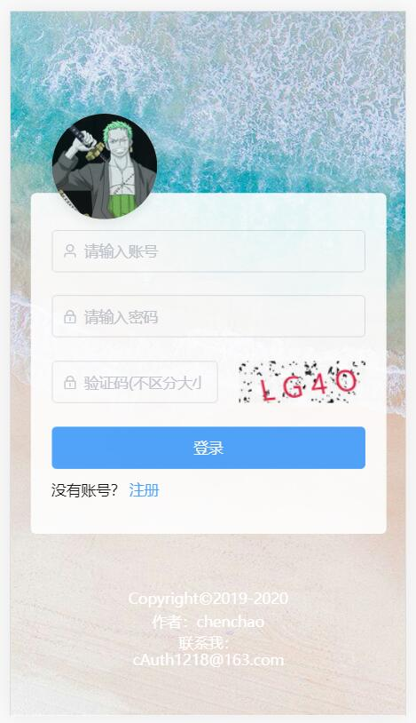

#### 2、聊天列表
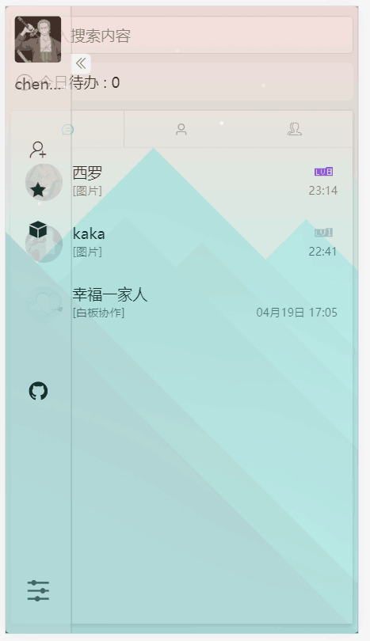
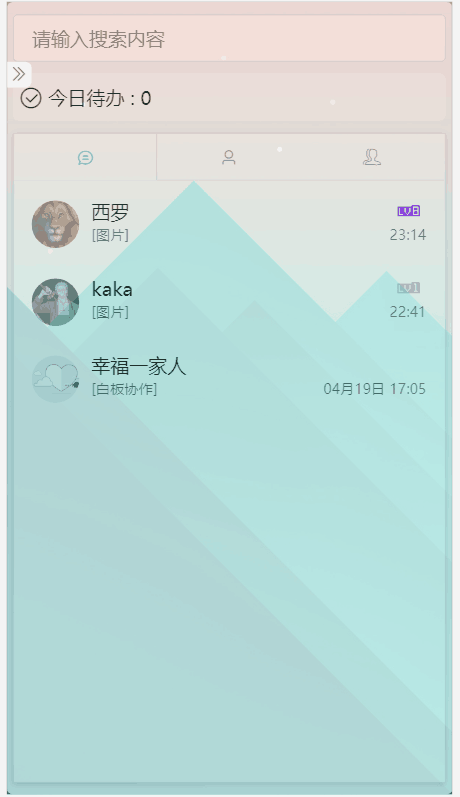

#### 3、聊天界面
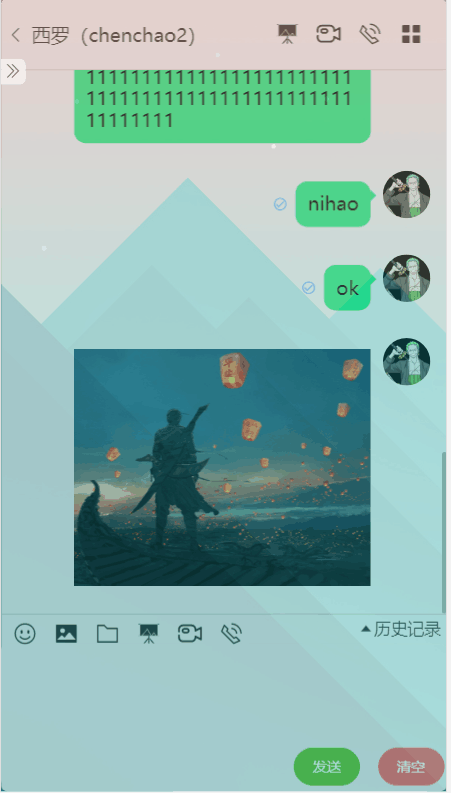

#### 4、图片预览


#### 5、换肤
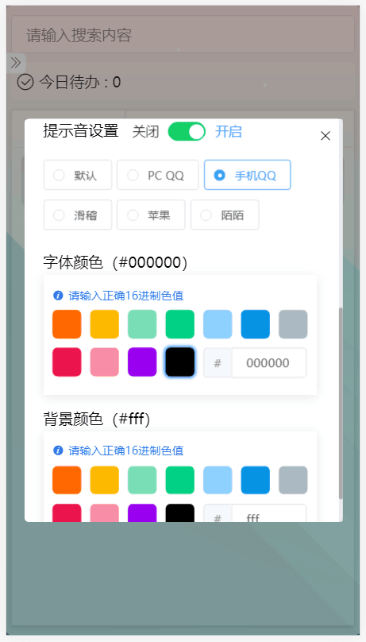

#### 6、朋友圈
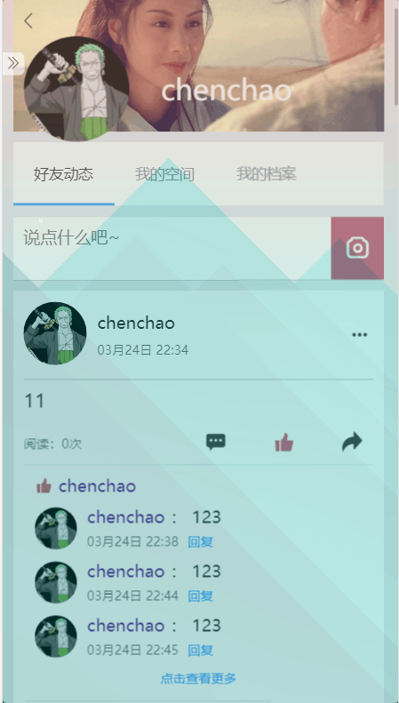

## 系统功能图

### 普通用户


### 管理员


## 技术路线

> 本系统分为`Client`，`Server`，`Admin`三个端：其中`Client`为客户端，`Server`为服务器端，`Admin`为管理员端。使用前后端分离的开发模式

- 客户端使用`Vue`、`VueX`、`Vue-Router`；
- 管理员端使用`React`、`antd`；
- 后端使用的是`node.js`；
- 数据库使用的是`MongoDB`；
- 在实现聊天的全双工数据通信使用的是`WebSocket`、`socket.io`。

## 项目打包

1. 客户端的代码打包后资源默认放在`chatServer`文件夹的`public`目录下；
2. 管理员端在`chatAdmin`的`build`目录下，需要自己自己手动将整个build目录复制到`chatServer`文件夹的`public`目录下，然后修改`build`目录文件的`index.html`中引入资源路径前都加上`/build`。

## 交流

- qq群


- `E-mail`：`ccdebuging@gmail.com`、`cAuth1218@163.com`
- `QQ`：`1831058205`
- 微信：`cAutg9248`

## 参考项目

- https://github.com/wuyawei
